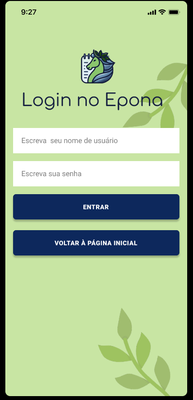
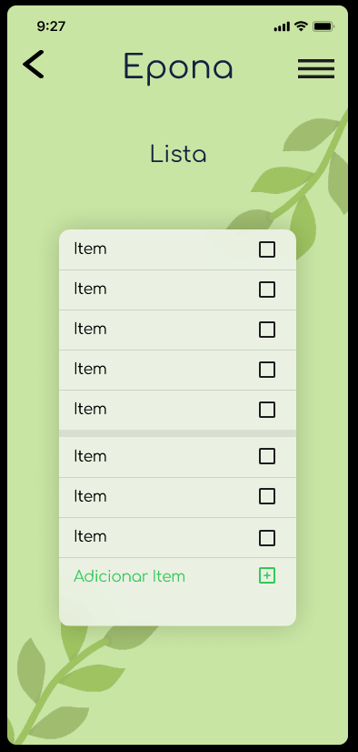
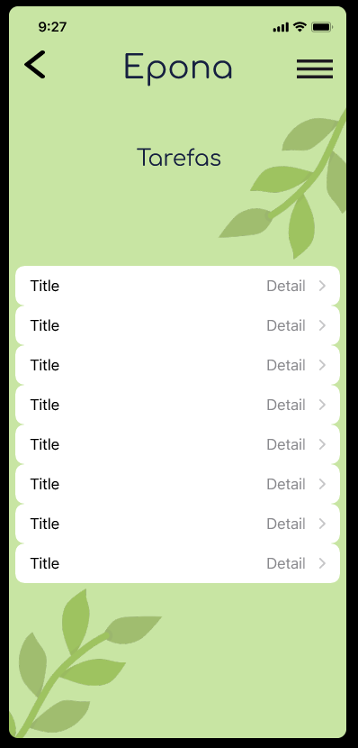
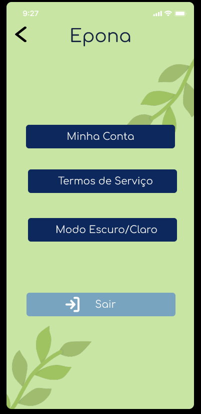
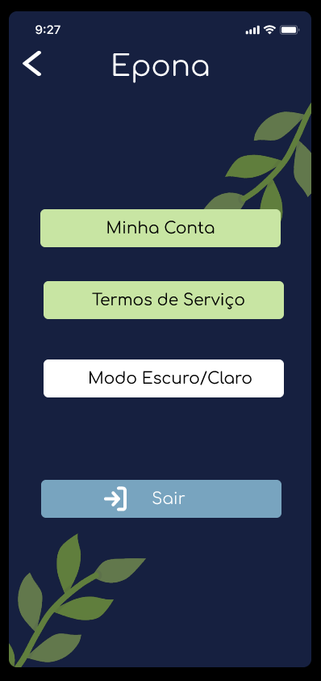
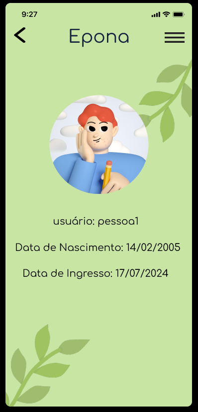

# EPONA

# Identidade Visual - Projeto Epona

Bem-vindo ao repositório do projeto Epona! Este projeto é dedicado à criação da identidade visual do aplicativo Epona, incluindo logos, paletas de cores, tipografia, e outros elementos visuais que definem a marca.

## Wireframes

Abaixo, você pode visualizar os wireframes do projeto. Eles foram desenhados para ilustrar a estrutura básica e o fluxo de navegação da interface do usuário.

  

## Design no Figma

O design completo do projeto Epona pode ser visualizado no Figma através do link abaixo:

[Figma - Projeto Epona](https://www.figma.com/proto/fIX2oSxePMEIrNzklt3nEP/Epona?node-id=2-43&t=WXRqUQJDRVOZOkPi-1)

## Telas Protótipo

Sequência das telas do protótipo desenvolvido no Figma:

[Canva](https://www.canva.com/design/DAGPnY7lVgg/pok9tHXxQKNTiy6x70pGtg/view?utm_content=DAGPnY7lVgg&utm_campaign=designshare&utm_medium=link&utm_source=editor)